# gnss-product-management Class Dependency Graph

```mermaid
classDiagram
    namespace Specifications {
        class Catalog {
            <<abstract>>
            +build()* classmethod
        }
        class Parameter {
            +name str
            +value Optional[str]
            +derivation DerivationMethod
        }
        class ParameterCatalog {
            +parameters dict
        }
        class PathTemplate {
            +template str
        }
        class Product {
            +name str
            +parameters List[Parameter]
            +directory PathTemplate
            +filename PathTemplate
        }
        class VersionCatalog~T~ {
            +versions dict
        }
        class VariantCatalog~T~ {
            +variants dict
        }
        class ProductSpec {
            +materialize() Product
        }
        class ProductSpecCatalog {
            +from_yaml() classmethod
        }
        class ProductCatalog {
            +build() classmethod
        }
        class FormatVariantSpec {
            +materialize() Product
        }
        class FormatSpecCatalog {
            +from_yaml() classmethod
        }
        class FormatCatalog {
            +build() classmethod
        }
        class Server {
            +host str
        }
        class ResourceProductSpec {
            +parameters List[Parameter]
            +directory PathTemplate
        }
        class ResourceSpec {
            +servers List[Server]
            +products List[ResourceProductSpec]
        }
        class SearchTarget {
            +product Product
            +server Server
            +directory PathTemplate
            +narrow() SearchTarget
        }
        class ResourceCatalog {
            +queries List[SearchTarget]
            +build() classmethod
        }
        class LocalCollection
        class LocalResourceSpec {
            +collections dict
        }
        class SearchPreference
        class Dependency
        class DependencySpec {
            +from_yaml() classmethod
        }
        class ResolvedDependency
        class DependencyResolution {
            +resolved List[ResolvedDependency]
        }
    }

    namespace Environments {
        class ProductRegistry {
            +load_parameters()
            +load_formats()
            +load_products()
            +load_remote_resources()
        }
        class WorkSpace {
            +register()
        }
        class RegisteredLocalResource {
            +spec LocalResourceSpec
            +server Server
        }
    }

    namespace Lockfile {
        class LockProductAlternative
        class LockProduct {
            +alternatives List[LockProductAlternative]
        }
        class DependencyLockFile {
            +products List[LockProduct]
        }
        class LockfileManager
    }

    namespace Adapters {
        class DirectoryAdapter {
            <<protocol>>
        }
        class FTPAdapter
        class HTTPAdapter
        class LocalAdapter
    }

    namespace Factories {
        class SourcePlanner {
            <<protocol>>
        }
        class RemoteSearchPlanner {
            -_product_catalog ProductCatalog
            -_parameter_catalog ParameterCatalog
            -_catalogs Dict[str, ResourceCatalog]
        }
        class LocalSearchPlanner {
            -_workspace WorkSpace
            -_product_registry ProductRegistry
        }
        class SearchPlanner {
            -_env ProductRegistry
            -_workspace WorkSpace
            -_remote_search_planner RemoteSearchPlanner
            -_local_search_planner LocalSearchPlanner
        }
        class ConnectionPool
        class ConnectionPoolFactory {
            +get() ConnectionPool
        }
        class WormHole {
            -_connection_pool_factory ConnectionPoolFactory
        }
        class DependencyResolver {
            +dep_spec DependencySpec
            +resolve() DependencyResolution
        }
        class FindPipeline {
            -_planner SearchPlanner
            -_transport WormHole
        }
        class DownloadPipeline {
            -_planner SearchPlanner
            -_transport WormHole
        }
        class LockfileWriter {
            -_manager LockfileManager
        }
        class ResolvePipeline {
            -_finder FindPipeline
            -_downloader DownloadPipeline
            -_writer LockfileWriter
        }
    }

    %% Inheritance
    Catalog <|-- ProductCatalog
    Catalog <|-- FormatCatalog
    Catalog <|-- ResourceCatalog
    DirectoryAdapter <|.. FTPAdapter
    DirectoryAdapter <|.. HTTPAdapter
    DirectoryAdapter <|.. LocalAdapter
    SourcePlanner <|.. RemoteSearchPlanner
    SourcePlanner <|.. LocalSearchPlanner

    %% Specifications internal
    ParameterCatalog --> Parameter
    PathTemplate --> ParameterCatalog
    Product --> Parameter
    Product --> PathTemplate
    VersionCatalog --> VariantCatalog
    ProductSpec --> Product
    ProductSpecCatalog --> VersionCatalog
    ProductSpecCatalog --> ProductSpec
    ProductCatalog --> VersionCatalog
    ProductCatalog --> Product
    ProductCatalog --> ProductSpecCatalog
    ProductCatalog --> FormatCatalog
    FormatVariantSpec --> Product
    FormatSpecCatalog --> VersionCatalog
    FormatSpecCatalog --> FormatVariantSpec
    FormatCatalog --> FormatSpecCatalog
    FormatCatalog --> ParameterCatalog
    ResourceProductSpec --> PathTemplate
    ResourceSpec --> Server
    ResourceSpec --> ResourceProductSpec
    SearchTarget --> Product
    SearchTarget --> Server
    SearchTarget --> PathTemplate
    ResourceCatalog --> SearchTarget
    ResourceCatalog --> ResourceSpec
    LocalResourceSpec --> LocalCollection
    DependencySpec --> SearchPreference
    DependencySpec --> Dependency
    DependencyResolution --> ResolvedDependency
    LockProduct --> LockProductAlternative
    DependencyLockFile --> LockProduct
    LockfileManager --> DependencyLockFile

    %% Environment
    ProductRegistry --> ParameterCatalog
    ProductRegistry --> FormatCatalog
    ProductRegistry --> ProductCatalog
    ProductRegistry --> RemoteSearchPlanner
    ProductRegistry --> ResourceSpec
    RegisteredLocalResource --> LocalResourceSpec
    RegisteredLocalResource --> Server
    WorkSpace --> RegisteredLocalResource
    WorkSpace --> LocalResourceSpec

    %% Factories
    RemoteSearchPlanner --> ProductCatalog
    RemoteSearchPlanner --> ParameterCatalog
    RemoteSearchPlanner --> ResourceCatalog
    RemoteSearchPlanner --> SearchTarget
    LocalSearchPlanner --> WorkSpace
    LocalSearchPlanner --> ProductRegistry
    LocalSearchPlanner --> SearchTarget
    SearchPlanner --> ProductRegistry
    SearchPlanner --> WorkSpace
    SearchPlanner --> RemoteSearchPlanner
    SearchPlanner --> LocalSearchPlanner
    ConnectionPoolFactory --> ConnectionPool
    WormHole --> ConnectionPoolFactory
    WormHole --> SearchTarget
    DependencyResolver --> DependencySpec
    DependencyResolver --> SearchPlanner
    DependencyResolver --> WormHole
    DependencyResolver --> ProductRegistry
    DependencyResolver --> DependencyResolution
    DependencyResolver --> LockfileManager
    FindPipeline --> ProductRegistry
    FindPipeline --> SearchPlanner
    FindPipeline --> WormHole
    DownloadPipeline --> ProductRegistry
    DownloadPipeline --> SearchPlanner
    DownloadPipeline --> WormHole
    DownloadPipeline --> LocalSearchPlanner
    LockfileWriter --> LockfileManager
    LockfileWriter --> DependencyResolution
    ResolvePipeline --> FindPipeline
    ResolvePipeline --> DownloadPipeline
    ResolvePipeline --> LockfileWriter
    ResolvePipeline --> DependencySpec
```

## Layer Summary

| Namespace | Role |
|---|---|
| **Specifications** | Pure data models — `Parameter`, `Product`, `SearchTarget`, catalogs, specs |
| **Environments** | Runtime registries — `ProductRegistry` owns catalogs; `WorkSpace` owns local resources |
| **Lockfile** | Lock file data model + `LockfileManager` for persistence |
| **Adapters** | Protocol + FTP/HTTP/Local implementations for directory listing |
| **Factories** | Orchestration — planners build `SearchTarget` lists; pipelines (`Find`, `Download`, `Resolve`) drive the actual work; `DependencyResolver` ties it all together |
